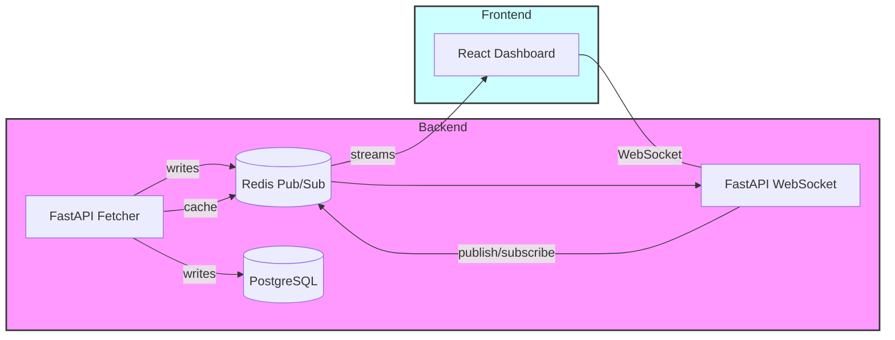
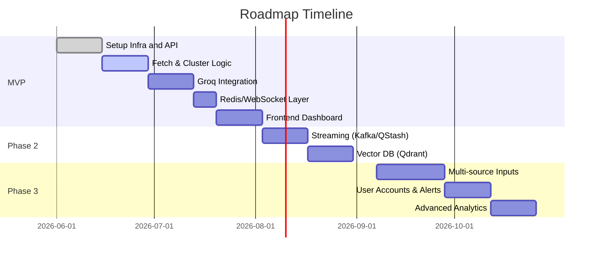

# Executive Summary  

Modern “trend intelligence” systems continuously monitor social media to detect emerging topics. For example, Apify’s **Reddit AI Radar** continuously scans subreddits and uses AI to score and summarise trends【51†L189-L197】. Similarly, our agent will poll Reddit (and later other sources) every few minutes, cluster new posts by semantic similarity, and minimise expensive LLM calls by triggering Groq analysis only on significant updates. The pipeline uses a FastAPI backend (deployed on Render) with background schedulers to fetch Reddit’s listing endpoints (e.g. `/r/{sub}/hot`, `/new`, etc)【18†L2051-L2059】, subject to OAuth rate limits (~100 requests/min)【3†L115-L119】. Redis (Upstash, free 256 MB) will cache hot data and act as a Pub/Sub broker for WebSocket updates【24†L151-L159】【46†L127-L135】. A lightweight Postgres store (Supabase) will archive historical trends, snapshots and AI summaries for retrieval. This report first details the MVP implementation plan (components, data flow, schedules, caching, schemas, deployment, etc.), then outlines phased improvements (Kafka/event streaming, vector DB, multi-source ingestion like Google Trends and YouTube, user alerts, scaling LLM use and costs). Operational policies (quotas, cache invalidation, retention) and trade-off tables compare Redis-only vs adding Postgres or Kafka. Finally, we include a backlog of features with effort estimates and Mermaid diagrams of the architecture and timeline.

## Phase 1: MVP Implementation Plan  

### 1. Data Ingestion (Reddit API)  
We will fetch Reddit data via the JSON API (authenticated with OAuth and a custom User-Agent)【1†L63-L71】【18†L2051-L2059】. Key endpoints are the listing endpoints: `GET /r/{subreddit}/hot`, `/new`, `/rising`, and `/top` (with a `t` parameter for time window)【18†L2051-L2059】【18†L2153-L2162】. Each request can specify `limit` (default 25, max 100) and pagination via `after`/`before` cursors【18†L2078-L2081】. For the initial MVP we’ll target one or a few popular subreddits (or `r/all`) to limit requests. Reddit enforces a **100 queries/min per OAuth client** rate limit【3†L115-L119】 (with a 10-minute average window). To avoid hitting limits or blocks, we must throttle our calls. In practice, scheduling e.g. 4–5 new- or top-post fetches per minute per client will stay under 100 QPM, leaving headroom for duplicate or retries. Each API response includes `X-RateLimit-Used/Remaining` headers, which our code should monitor. Because Reddit requires OAuth and a unique User-Agent, we will configure the FastAPI service with a credentials file or environment variable for the OAuth token, and set a User-Agent like `TrendAgent/1.0 (by /u/yourname)`【1†L63-L71】.  

**Polling schedule:** We plan to run polling jobs every 1–5 minutes. For example, an APScheduler `BackgroundScheduler` cron job can wake every minute to fetch new posts【21†L253-L262】. We will batch-fetch (e.g. top and new lists) to maximize throughput. If rate limits threaten, back-off by delaying or skipping cycles.  

**Data flow:** Each fetch job retrieves the latest posts (title, content, score, timestamps, etc.) from each subreddit. These raw posts are first compared against cache (see below) to discard already-processed entries. New posts are then embedded and clustered (Section 3). For efficiency, we may store a “seen post IDs” set in Redis to filter duplicates quickly.  

### 2. Background Workers & Scheduling  
The FastAPI app will run background tasks for ingestion and processing. We can use APScheduler’s `BackgroundScheduler` to schedule recurring jobs (cron or interval triggers) within the running FastAPI process【21†L253-L262】. For example:  

```python
from apscheduler.schedulers.background import BackgroundScheduler
sched = BackgroundScheduler()
sched.add_job(fetch_reddit_posts, 'interval', seconds=60)  # every minute
sched.start()
```  

Alternatively, we could launch separate worker processes (e.g. Celery with Redis broker) for heavy tasks like embedding, but given free-tier constraints we’ll aim for simplicity. Initial MVP can run all tasks in one FastAPI service (with async I/O for HTTP and Redis calls). If needed, one-off jobs (cron style) can be added in Render’s one-off job/cron capability or using Upstash QStash (which provides a serverless scheduler)【46†L127-L135】.  

### 3. Local Clustering & Embeddings for Deduplication  
To identify trending topics and avoid repetition, we will cluster semantically similar posts. Our approach: use a lightweight sentence-transformer model locally (e.g. `all-MiniLM-L6-v2`) to encode each post’s title or text into an embedding. Then, perform clustering or nearest-neighbor search. Two possible methods are: **thresholding** or **k-means/Agglomerative clustering**. 

The typical procedure (inspired by deduplication guides) is to generate embeddings and then mark entries with cosine similarity above a high threshold (e.g. 0.95) as duplicates【27†L54-L63】【27†L69-L77】. For efficiency on many items, one can index embeddings with an ANN library (FAISS, Annoy) and compare only nearest neighbors【27†L59-L63】. For initial MVP we might keep a small in-memory list of “recent posts” and do pairwise cosine checks (since polling is frequent, each batch is small). 

Alternatively, we can cluster the embeddings using scikit-learn: e.g. k-Means (with a chosen K) or Agglomerative (specifying a distance threshold)【26†L614-L623】. Sentence-Transformers documentation notes k-means if number of clusters is known, or agglomerative if not【26†L614-L623】【26†L620-L628】. We may start with an agglomerative approach to dynamically find clusters of overlapping content. Each cluster will represent a “trend”. We keep cluster centroids or representative post IDs in Redis as the current trending items. 

**Embeddings approach:** Use a CPU or small GPU inference. The `sentence-transformers` library (HuggingFace) is easy to use in Python. E.g. `from sentence_transformers import SentenceTransformer; model = SentenceTransformer('all-MiniLM-L6-v2')` and then `model.encode(texts)` to get vectors. These vectors (e.g. 384D floats) are small (a few KB per post) so many can fit in memory. We will *not* call Groq/LLM to generate embeddings, since local SBERT models suffice for similarity. This clustering step reduces the number of times we need to call Groq for summarisation (only do so on cluster “leaders” or when trends shift significantly).  

### 4. Redis Caching & WebSocket Updates  
We will use Redis (Upstash free tier, 256MB) both as a cache and a Pub/Sub broker. **Cache design:** Use Redis hash or sorted-sets to store trending clusters and metadata. For example, keys could be namespaced like `trend:{cluster_id}` containing fields (score, last_updated), and `trend:{cluster_id}:summary` for the AI summary. Following Redis naming best practices【30†L189-L197】, we use short, descriptive keys (e.g. `trend:123:score`). 

New trend scores (e.g. total upvotes or rate of new posts) will be updated frequently. We should set expiries on old clusters: e.g. if no new posts added to a cluster for 24h, remove it. This auto-expiry prevents filling the 256MB store. We also cache raw API results briefly: e.g. Redis `seen_posts` set with expiry ~1h to de-duplicate immediate repeats. 

**WebSockets & Pub/Sub:** The live dashboard will connect to the FastAPI backend via WebSockets. When a trend cluster is updated (new posts or new AI summary), the backend publishes a message on a Redis channel. The FastAPI WS handler (one per server instance) subscribes to this channel and pushes updates to connected clients. This follows a standard pattern: publish changes to Redis, and all instances receive them【24†L168-L171】. As OneUptime explains, Redis pub/sub lets any server instance forward messages to its local WebSocket clients, ensuring all clients see the same live updates【24†L168-L171】. This design also supports horizontal scaling (if later adding more backend instances): each instance simply runs the same subscription code.  

In summary, the data flow is: Polling job → produce new/updated trends → update Redis (cache state, publish events) → FastAPI WS pushes to React frontend.  

### 5. Minimal Database Schema (PostgreSQL)  
For durability and historical analysis, we will use a Postgres database (e.g. Supabase free tier). Core tables:  
- **`trends`**: one row per tracked topic/cluster (id, name/keyword, first_seen timestamp).  
- **`trend_snapshots`**: periodic snapshots of metrics (trend_id, timestamp, post_count, score, etc) to allow time-series queries.  
- **`ai_summaries`**: stores Groq-generated summaries (trend_id, snapshot_id, summary_text).  

This schema lets us keep long-term records (beyond Redis TTL) for charts or re-analysis. Index on timestamp for querying recent trends. In Phase 1, we may only store a few days/weeks of history.  

### 6. Groq Integration and Trigger Rules  
Groq LLM calls are costly and rate-limited (e.g. free limits ~30 requests/min and 6K tokens/min per model【37†L295-L303】). To minimise usage: only call Groq when a new trend emerges or materially changes. For instance, after clustering, identify clusters with rising activity, then call Groq once per cluster to generate a summary and key insights. We can use simple heuristic triggers: e.g. if a cluster’s total upvotes or size jumps by 50% or a new timeframe (daily), then refresh the summary. Otherwise, reuse the cached summary.  

Groq responses (summaries, explanations) will be written into Redis (short-term cache) and also into the Postgres `ai_summaries`. Each Groq call should include in the prompt only essential info (e.g. list of top posts’ titles) to cut token use. We’ll monitor Groq’s response headers (they include remaining tokens etc) to avoid hitting limits【37†L529-L537】.  

### 7. Caching & Expiry Strategy  
Redis keys will use TTLs to keep data fresh. For example, a trending cluster’s summary might expire in 6–12 hours so that stale trends automatically drop. The raw `seen_posts` cache of processed post IDs can expire hourly. If trends become too cold or memory is tight, we rely on Redis’ LRU eviction (Upstash settings) plus our own expiries. The Postgres store has no auto-expiry but we can implement a retention policy (e.g. delete snapshots older than 3 months) to save space.  

### 8. WebSocket Update Flow  
When the backend detects an updated trend (new cluster or updated score), it publishes a JSON message on a Redis channel (e.g. channel `trend_updates`). Each FastAPI WebSocket connection manager listens on that channel. When a message arrives, the server loops through its local clients and sends them the update. On the React/Vercel side, clients subscribe via a WebSocket (wss) endpoint and render changes in real time (updating charts or lists). Clients can also request initial trend data via a REST endpoint on first connect.  

### 9. Deployment (Render & Vercel)  
- **Backend (FastAPI):** Deploy on Render as a **Web Service**. Render supports Python ASGI (Uvicorn) and allows inbound WebSockets【53†L197-L200】. We’ll add environment variables on Render for Reddit OAuth credentials, Groq API keys, and Upstash URL/token (Vercel’s Upstash integration can set REDIS_* envvars【46†L127-L135】, which Render can similarly use). For always-on operation, ensure the service has at least a Hobby tier container (free tier sleeps after 15 min idle, so use paid Hobby to stay live). Use Render’s health checks (`/health`) to automatically restart if the app crashes.  

- **Frontend (React):** Deploy on Vercel. Vercel natively supports static/Next.js apps and can integrate with Upstash Redis【46†L127-L135】. We’ll build a minimal dashboard showing trending topics and graphs. Environment variables (e.g. API endpoint URL) will be set via Vercel dashboard.  

- **Upstash Redis:** We link an Upstash Redis database to the project. Upstash offers a free 250–256 MB Redis with auto-scaling to higher plans【31†L149-L154】【46†L127-L135】. It’s accessed via REST endpoints (no open socket), which works on serverless platforms. Store the Redis URL and token in env variables. (Upstash also has a serverless vector DB product, which could be used later.)  

Deployment commands (simplified):  
   - *Render:* Use `render.yaml` or Dashboard: set service type to “Web Service”, point to FastAPI code (requirements.txt, start command `uvicorn main:app`).  
   - *Vercel:* Connect GitHub repo, ensure build script (if any). Use `@vercel/redis` integration to automatically provision Redis.  

### 10. Monitoring, Logging, and Testing  
We will instrument logging on key events (fetch errors, rate-limit hits, cache evictions) using either built-in logging or an error tracker (Sentry). Render provides in-dashboard logs. We should expose a `/health` endpoint for uptime checks. Unit tests should cover the API endpoints (e.g. test a mock fetch flow with sample JSON). Integration tests can simulate a small number of Reddit posts to verify trend detection. For Groq and embeddings, we may use fixture data.  

### 11. Security and Credentials  
All credentials (Reddit client secret, Upstash tokens, Groq API key) are stored as environment variables on Render/Vercel (never in code). FastAPI should disable CORS or restrict origins to the frontend domain. We do not need user login in Phase 1, so no auth is required. However, Groq calls should be rate-limited server-side to prevent abuse of our quota. 

## Phase 2/3 Roadmap  

1. **Streaming Infrastructure (Kafka/QStash):** Once scale demands increase, introduce a real message queue. Apache Kafka (or Upstash’s QStash) can decouple data ingestion from processing, enabling fan-out. For example, poll jobs write raw posts/events to Kafka topics, and separate consumer workers do clustering/analysis. This allows adding more workers without hitting Redis pub/sub or single-thread limits. (Kafka adds complexity and operational cost vs Redis, but is more resilient at scale.)  

2. **Vector Database:** Instead of caching embeddings in RAM, use a specialized vector store (e.g. Qdrant, Pinecone, or Upstash Vector DB) to index post embeddings for quick nearest-neighbor search【27†L59-L63】. A vector DB will handle larger embedding sets with efficient ANN lookup. This enables sophisticated similarity queries (e.g. “find posts similar to X”). We could migrate our local clustering to use this persistent index.  

3. **Time-Series Forecasting:** Add automated trend forecasting. For each trend’s time-series (from `trend_snapshots`), use models like Facebook Prophet or PyTorch forecasting to predict future interest. Display projected trajectories on the dashboard. This helps anticipate surges.  

4. **Multi-Source Ingestion:** Extend beyond Reddit:  
   - **Hacker News:** The official HN API (Firebase v0) provides near-real-time data with *no rate limit*【48†L246-L254】. Endpoints like `/v0/topstories.json` return current top IDs【49†L1-L4】. We can fetch those and treat them as a “tech news” feed.  
   - **Google Trends:** Google recently released an official Trends API (in alpha) for search data【58†L2841-L2844】. When available, integrate it for broader trend signals (e.g. keyword search interest). In the meantime, use the PyTrends library or scrape Search queries.  
   - **YouTube:** Use YouTube Data API’s `videos().list(chart='mostPopular')` to fetch currently trending videos (regionally)【60†L237-L244】. Map video categories to topics.  
   - **News API:** Integrate a News API (NewsAPI.org, or RSS scrapers) to catch trending news headlines.  
These sources complement Reddit signals and can be polled at lower frequency (e.g. every 10–60 minutes).  

5. **User Accounts & Alerts:** Build a user system (via Supabase Auth) so users can subscribe to specific topics or keywords. Allow setting alerts (email, SMS, or Slack) when a trend crosses a threshold. This involves storing user preferences, and a notification service (e.g. using SendGrid or Twilio).  

6. **Scaling Groq Usage:** To handle more analysis without big quotas, consider: prompt engineering to reduce tokens, prompt caching (store previous query results), or mixing in an open-source LLM (for less critical tasks). For example, short summaries might use a smaller local model. We could also schedule Groq calls less frequently (e.g. night-time batch for summaries) if live updates aren’t needed.  

7. **Cost Estimates:**  
   - *Groq:* Beyond free tier, Groq charges per token. If we assume ~100 calls/day × 500 tokens per call, that’s 50k tokens/day. At typical pricing (e.g. $0.002/token), cost ~ $100/month. Use quotas to cap usage.  
   - *Upstash:* Free for 256MB and 500K commands. If we exceed, pay ~$0.20 per 100k commands and $0.25/GB for storage【31†L149-L154】. Our usage is mostly ephemeral, so expect free tier to suffice initially.  
   - *Render/Vercel:* Both have free tiers but usage (always-on backend, DB, bandwidth) may require $0–20/month.  
   - *Vector DB:* Using a managed vector DB (Pinecone, etc.) may cost $50+/month depending on scale.  

## Operational Policies  

- **API Quotas:** Monitor Reddit and Groq rate limits on each call. If near limit, delay or queue jobs. Respect Upstash rate (10k ops/s on free) by batching Redis commands in pipelines.  
- **Reanalysis Cadence:** Define how often to refresh AI summaries. E.g., re-run Groq analysis on a trend only every 6 hours or when the trend’s score doubles. Similarity clustering can run every poll.  
- **Cache Invalidation:** Use TTLs as described. Also, periodically clear the WebSocket channel backlog if undelivered. Refresh front-end data (via REST) if reconnection occurs after downtime.  
- **Data Retention:** Keep Redis as a short-term store (days). Move permanent storage to Postgres. For example, raw fetched posts might be dropped after summarisation. Historical trend snapshots older than N weeks could be pruned.  

## Trade-Offs Comparison  

| **Architecture**               | **Pros**                                                                 | **Cons**                                                                  |
|--------------------------------|-------------------------------------------------------------------------|---------------------------------------------------------------------------|
| **Redis-only (no DB)**         | Simplest deployment; very fast reads/writes; ephemeral, no ops cost.    | Limited memory (256MB); volatile (data lost on restart); poor long-term retention. Cannot query history.|
| **Redis + Postgres (Supabase)**| Fast cache/pubsub + durable store; history is persisted; familiar SQL.  | More complexity (data sync needed); slight latency for writes; must manage migrations.|
| **Add Kafka/QStash**           | Decouples producers/consumers; reliable queue; replay history possible. | Additional infrastructure overhead (cluster or managed service); learning curve.|
| **Add Vector DB**              | Efficient large-scale semantic search; offloads embedding indexing.     | More costs (new service); eventual consistency issues; complexity of syncing text data into it. |

*(Pros/cons based on standard patterns; see e.g. Redis pub/sub scaling【24†L168-L171】 and use of vector search for dedup【27†L59-L63】.)*

## Prioritised Feature Backlog  

- **User: MVP trending dashboard (Initial)** – small (2 wk) – *Implement basic pipeline, Redis caching, WebSocket updates, minimal UI.*  
- **API: Reddit integration & scheduler** – small (1 wk) – *Setup OAuth, fetch endpoints, handle rate limits.*  
- **Engine: Embedding and clustering** – medium (2 wk) – *Add sentence-transformer, cluster logic, test with sample data.*  
- **LLM: Groq summarisation** – medium (2 wk) – *Formulate prompts, integrate Groq API, cache summaries.*  
- **Infra: Deployment setup** – small (1 wk) – *Provision Render/Vercel, Connect Upstash, environment variables.*  
- **Testing & Monitoring** – small (1 wk) – *Write integration tests; set up logging and health checks.*  
- **Phase 2: Kafka/QStash messaging** – medium (2 wk) – *Ingest posts via queue, process with workers.*  
- **Phase 2: Vector DB integration** – medium (3 wk) – *Spin up Qdrant/Milvus, index embeddings for search.*  
- **Phase 2: Google Trends & YouTube** – small (1 wk) – *Add polling from Trends API and YouTube API.*  
- **Phase 3: User accounts & alerts** – medium (3 wk) – *User login, subscriptions, email/SMS alerts.*  
- **Phase 3: Forecasting & Analytics** – medium (2 wk) – *Time-series forecasting models for trends.*  

These estimates assume one developer. Small=~1 week, Medium=2–3 weeks.  





**Next Steps:** Begin by prototyping the FastAPI polling and Redis cache. Create a free Upstash Redis and test basic Pub/Sub updates to a dummy WebSocket client. Verify Reddit endpoint access and rate-limits (adjust schedule accordingly). Set up a Supabase database and test writing trend records. Install a sentence-transformer model and test embedding/clustering on sample Reddit data. Finally, integrate Groq with a sample prompt. Each step should be scripted (e.g. with `pip install` or `render.yaml` as needed) and documented in version control for reproducibility.  

**Sources:** Reddit API docs (endpoints & rate limits)【18†L2051-L2059】【3†L115-L119】; FastAPI scheduling tips【21†L253-L262】; Redis pub/sub scaling with WebSockets【24†L151-L159】【24†L168-L171】; Redis key naming conventions【30†L189-L197】; Sentence-Transformers deduplication【27†L54-L63】【26†L614-L623】; Groq rate-limit guidelines【37†L295-L303】; Hacker News API docs【48†L246-L254】【49†L1-L4】; Google Trends API announcement【58†L2841-L2844】; YouTube Data API (mostPopular chart)【60†L237-L244】; Upstash & Vercel integration【46†L127-L135】【31†L149-L154】.